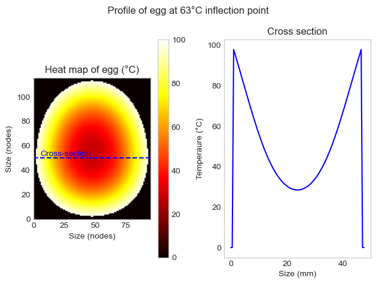

# Diffusion models

There are many physical systems that can be modelled using a generic diffusion function.

This repository is a collection of some of the diffusion models I've created.

## Projects

### Ajitsuke Tamago (Ramen eggs) - Thermal diffusion model

* [Read full HTML report](https://stevenafowler.github.io/profile/Ajitsuke%20Tamago.html)
* [Jupyter Notebook - note videos will not display in GitHUB viewer](https://github.com/StevenAFowler/diffusion_models/blob/9-updates-on-diffusion-area-linked-to-profile-26/AjitsukeTamago/Ajitsuke%20Tamago.ipynb)

## WIP

Drug diffusion in tumors

* TBC

Primary packaging with oxygen scavenger

* TBC
