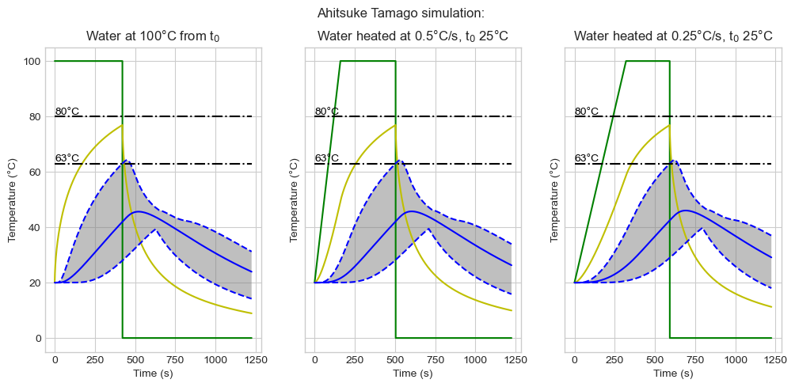

# Diffusion models

There are many physical systems that can be modelled using a generic diffusion function.

This repository is a collection of some of the diffusion models I've created.

## Projects

Ajitsuke Tamago (Ramen eggs) - Thermal diffusion model

* [Report](https://stevenafowler.github.io/diablothewonderdog/Ajitsuke%20Tamago.html)
* [Jupyter Notebook](https://github.com/StevenAFowler/diffusion_models/blob/6-draft-egg-boiling-report/Ajitsuke%20Tamago.ipynb)

Drug diffusion in tumors

* TBC

Primary packaging with oxygen scavenger

* TBC
